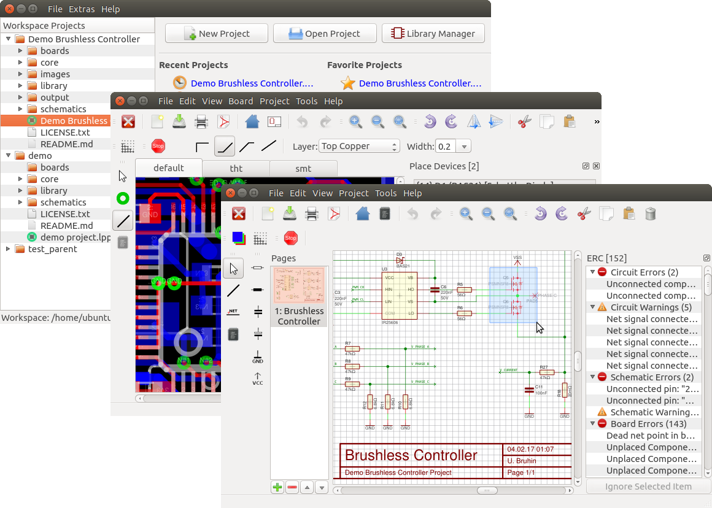

# LibrePCB User Manual

Welcome to the documentation of [LibrePCB](http://librepcb.org)!
LibrePCB is a free EDA software to develop printed circuit boards.
It runs on Linux, Windows and Mac.

{}
This documentation is currently under construction. Contributions
are welcome! Check out https://github.com/LibrePCB/librepcb-doc
{}

