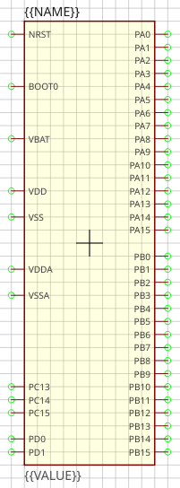
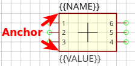
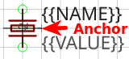
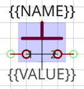

[NOTE]
====
These guidelines are not yet complete. Help us create sensible conventions
https://github.com/LibrePCB/librepcb-doc/issues?q=is%3Aissue+label%3A%22Conventions%3A+Symbols%22[on GitHub]!
====

[#libraryconventions-symbols-genericspecific]
== Generic vs. Specific

Generic components should have generic symbols. For example a diode (let's
say _1N4007_) doesn't need its own symbol, a generic diode symbol is fine.
So you should name it something like "Diode" and use the same symbol also
for all other standard diodes. Of course every kind of diode (e.g. Zener)
should have its own symbol because they look different.

On the other side, there are many very specific components, for example
a microcontroller. Even if it's possible to also use generic symbols for
them (e.g. "32-Pin IC"), you should create a symbol specific for that part
instead. This way you can choose a reasonable
<<libraryconventions-symbols-pinplacement,pin placement>>.

[#libraryconventions-symbols-naming]
== Naming

Following conventions apply to symbol names:

- Language must be American English (en_US)
- Title case (e.g. "Capacitor Bipolar" instead of "Capacitor bipolar")
- Singular names, not plural (e.g. "Diode" instead of "Diodes")
- If reasonable, start with the generic term (e.g. "Supply GND" instead
  of "GND Supply") to improve navigation in sorted lists (all supply
  symbols are listed next to each other)

// Image spans across multiple sections

[#libraryconventions-symbols-origin]
== Origin

The origin _(0, 0)_ must be at the center of the symbol (not including
text elements). For non-symmetrical symbols it should be as close as
possible to the center, but still on the 2.54mm grid.

[#libraryconventions-symbols-outline]
== Outline

The outline of a regular symbol should be drawn with a rectangle or a polygon.
All vertices should be located on the 2.54mm grid and following properties
should be used:

- *Layer*: _Outlines_
- *Line Width*: _0.2 mm_
- *Filled*: _no_
- *Grab Area*: _yes_

Special symbols (like a capacitor) might not have a regular outline, in such
cases it's allowed to use different properties to draw the symbol geometry.

[#libraryconventions-symbols-pinplacement]
== Pin Placement

- For integrated circuit symbols (i.e. rectangular outline), generally
  *don't place pins at the top and bottom edges*, but only on the left and
  the right. This helps to get clear, easily readable schematics.
- *Group pins by functionality*, not by physical location of the leads or by
  datasheet. Always keep the typical application circuit in mind and choose
  pin locations which help to get clear schematics with only few crossed-over
  net lines. For example put _GND_ exactly 5.08mm below the _VCC_ pin if it's
  likely that capacitors need to be connected to them (capacitors have a
  height of 5.08mm). Or place _D+_ and _D-_ of a USB device right on top of
  each other (with the default distance of 2.54mm) as they are always used
  as a pair.
- *Use a pin length of 2.54mm* if possible. Other pin lengths should be used
  only in special cases.

[#libraryconventions-symbols-pinnaming]
== Pin Naming

If the function of a pin is absolutely clear (e.g. anode/cathode of a diode),
choose its abbreviated functionality as name (e.g. "A" for anode and "C" for
cathode). If the functionality is not clear in the symbol (because it's
defined by the component using that symbol), just use numbers starting with
"1" at top left and increment them counterclockwise.

[#libraryconventions-symbols-textelements]
== Text Elements

Typical symbols should have exactly two text elements: `{{NAME}}` and
`{{VALUE}}`.

For rectangular symbols, the name should be placed at top left, aligned at
bottom left to the corner of the symbol outlines. And the value should be
placed at bottom left, aligned at the top left to the corner of the symbol
outlines.

Irregularly shaped symbols may have text elements placed differently, see for
example the crystal at the left. Keep in mind that the value of a component can
consist of several lines, so there should always be enough space available for
it.

.Typical text element properties
[cols="s,e,e",options="header,autowidth"]
|===
| Property          | Name text element     | Value text element
| Layer             | Names                 | Values
| Text              | {{NAME}}              | {{VALUE}}
| Alignment         | Bottom Left           | Top Left
| Height            | 2.5mm                 | 2.5mm
| Rotation          | 0°                    | 0°
|===

[#libraryconventions-symbols-grabarea]
== Grab Area

The grab area is the region of a symbol where it can be grabbed with the
mouse (to move it, or to open the context menu). Symbols which have a
single outline (like an IC) should typically have the "Grab Area" property
set on the outline polygon (which makes the area filled with yellow color).

For symbols which have a more complex outline or which do not look nice
with the yellow fill you should add an extra polygon to explicitly define
the grab area. See the blue area of the push button for example. Ensure
that the polygon doesn't overlap with pins and use following polygon
properties:

- *Layer*: _Hidden Grab Areas_ (will not be visible in the schematic editor)
- *Line Width*: _0.0 mm_
- *Filled*: _yes_
- *Grab Area*: _yes_

[NOTE]
====
The origin cross of a symbol is always also an implicit grab area. So even
if there is no explicit grab area defined, the symbol can still be grabbed.
====
