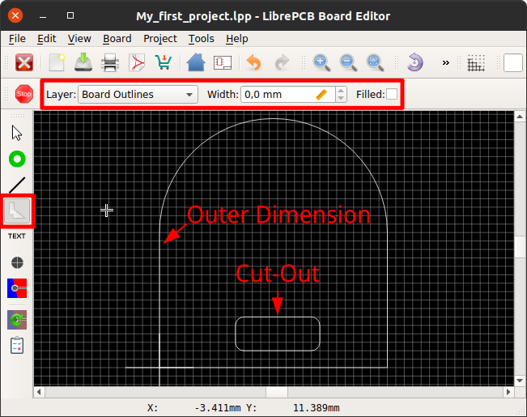
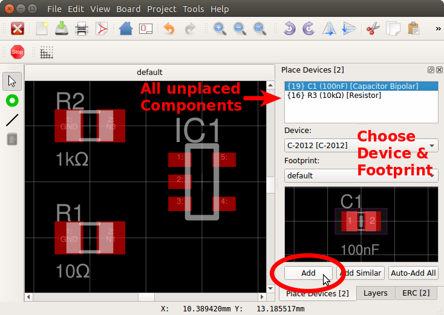
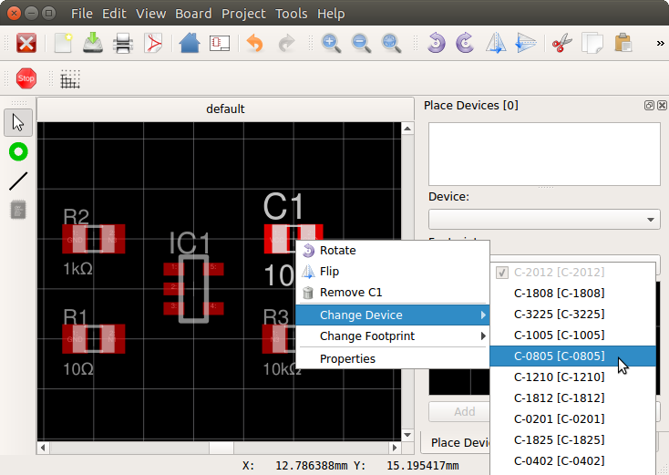

[#gettingstarted-boards]
= Create Boards

Once the schematic is (more or less) complete, you can start designing the
PCB with the board editor.

[#gettingstarted-boards-outlines]
== Draw Outlines

The most important thing of the board is its outline. Generally there must be
**a single, closed polygon on the _Board Outlines_ layer**. It is recommended
to set its **line width to 0.0mm** since -- in contrast to many other polygons
-- this polygon does not represent any actual material but only the outer
dimension of the PCB.

If your PCB needs non-plated cut-outs (e.g. slots, windows, ...), just draw
these polygons exactly the same way as the outer board outline. These polygons
are implicitly considered as cut-outs since they are located _within_ the
outer polygon.

[IMPORTANT]
====
All polygons on the _Board Outlines_ layer shall represent the actual board
outlines (i.e. the edges), **NOT** the paths for the milling cutter! The PCB
manufacturer will automatically offset the outline polygons to calculate the
actual paths for the cutter.
====

[NOTE]
====
Keep in mind that inner edges can only be produced with a specific minimum
radius (corresponding to the milling cutter diameter of the PCB manufacturer).
Although PCB manufacturers may produce your PCB anyway even if it contains
inner edges with no or too small radius, it's highly recommended to draw
all inner edges with a proper radius. Often a radius of 1.2mm or more works
fine, while a smaller radius might lead to additional cost.

To draw polygons with arcs, open _Properties_ from the polygon's context menu
and specify the vertex coordinates and angles manually.
====

[IMPORTANT]
====
A correct board outline is really crucial to avoid problems during the
PCB manufacturing process! Make sure to fulfil these rules:

* There's exactly one polygon to define the outer board outline
* Cut-out polygons (if there are any) are located fully inside the outer board
  outline
* There are no tangent or intersecting _Board Outlines_ polygons
* Polygon layer is _Board Outlines_ and line width is 0.0mm (the latter is
  optional, but recommended)
* Polygons are closed (start and end coordinates are exactly identical) and
  consisting of a single polygon object (**NOT** multiple joined lines!)
* There are no other objects on the _Board Outlines_ layer
====

[#gettingstarted-boards-devices]
== Place Devices

For every Component in the schematic, you need to place a Device
in the board (except schematic-only Components, like the schematic frame). In
the _Place Devices_ dock on the right side of the board editor you can see all
unplaced Components. For every Component you can choose its corresponding Device
and add them to the board:

By the way, it's even possible to replace Devices after adding them to
the board. For example you can replace a _C-1210_ capacitor with a _C-0805_
capacitor using the Device context menu:

Then you can start adding vias and traces to connect the pads together.
