[#gettingstarted-libraries]
=== Add Libraries

Before you can start with creating new projects, you need to add some libraries
to your Workspace. Libraries contain various kinds of elements which can be added
to schematics and boards (e.g. symbols and footprints).

To open the Library Manager, click on the corresponding button in the Control
Panel (or on the link in the shown warning, but the warning will disappear after
you add a library):

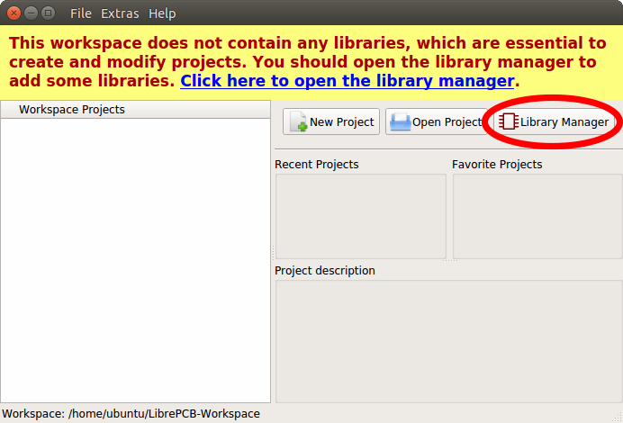

[#gettingstarted-libraries-remote]
==== Download Remote Libraries

The Library Manager directly fetches the list of available libraries from the
Internet. Most of these libraries are hosted at https://github.com/LibrePCB-Libraries.

[NOTE]
====
The provided libraries currently contain only a few elements, especially because
the file format is still not considered as stable.
====

The most important library is the _LibrePCB Base Library_ because it contains the
most commonly used library elements (like resistors or diodes). It is highly
recommend to install this library. To do so, just select the checkboxes at the
right and click on the _Download and install/update all selected libraries_ button:

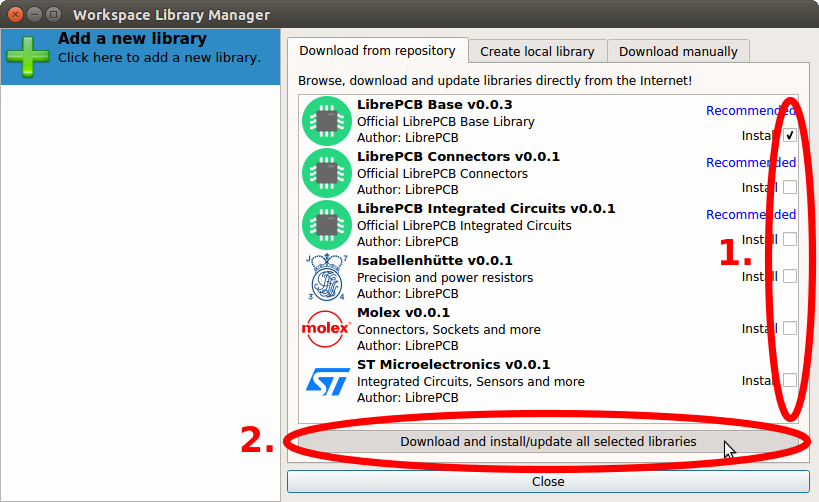

By the way, the same way you can also update already installed libraries to the
latest version. You should regularly update all libraries to get more elements
and bugfixes/improvements of existing elements.

[NOTE]
====
Dependencies between different libraries are automatically taken into account
when changing the selection. So for example if you select _LibrePCB Connectors_,
the _LibrePCB Base Library_ will automatically be selected too because the
Connectors library depends on it.
====

[WARNING]
====
Downloaded (so-called _remote_-) libraries are always read-only because otherwise
local modifications could cause conflicts when updating the library the next time.
But this should not be an issue, just follow the guide below to create your own
local library. In a local library you can extend, or even overwrite existing
library elements (by using a higher version number to enforce higher priority).
====

[TIP]
====
If you are familiar with Version Control Systems (e.g. _Git_) and want to use
them to manage your libraries (instead of the Library Manager), just clone the
libraries into the subdirectory `v0.1/libraries/local/` in your Workspace.
====

[#gettingstarted-libraries-local]
==== Create Local Libraries

Of course you can also create your own libraries. To do so, enter some metadata
in the tab _Create local library_ and click on _Create Library_:

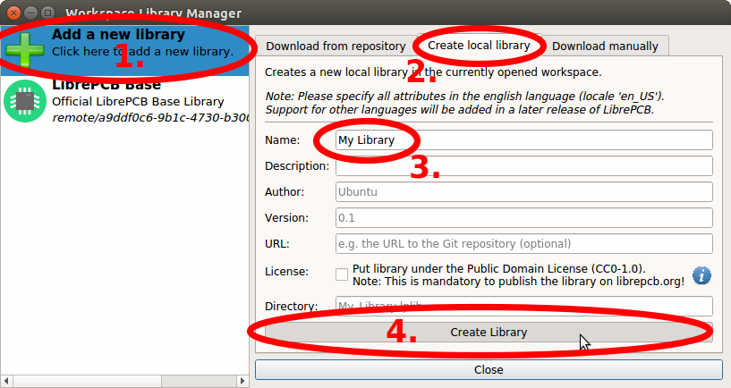

Now you can open the library editor to create some symbols and footprints in
your new library. Select your library on the left and then click on the
_Open Library Editor_ button:

image:img/library_manager_open_editor.png[alt="Open Library Editor"]

Now we need a crash course to understand the basics of LibrePCB's library
concept ;) A library consists of several different elements:

* *Component Category*:
  These are basically "metadata-only" elements used to categorize the "real"
  library elements in a category tree. Every Symbol, Component and Device can be
  assigned to one or more categories so they will appear in the category tree.
  Examples: _Resistors_. _LEDs_, _Microcontrollers_
* *Symbol*:
  A symbol is the graphical representation of a Component (or parts of it) in a
  schematic. It consists of electrical pins and graphical objects like lines.
  Examples: _European Resistor_, _LED_, _1x10 Connector_
* *Component*:
  A Component basically represents a "generic" kind of electrical part. It's
  *not* a real part which you can buy, it's just theoretical. The Component
  defines the electrical interface of a part and how it is represented in the
  schematic (by referencing one ore more Symbols). But it does not defines how
  the part looks like in a board.
  Examples: _Resistor_, _Bipolar Capacitor_, _4-channel OpAmp_
* *Package Category*:
  Exactly the same as Component Categories, but for Packages instead of Components.
  Examples: _Chip Resistors_, _Axial Capacitors_, _DIP_
* *Package*:
  As the name suggests, packages represent the mechanical part of a "real"
  electronic part. It contains the footprint with their electrical pads and
  graphical objects which is then added to boards. Later a package may also
  contain a 3D model for the 3D board viewer.
  Examples: _TO220_, _DIP20_, _LQFP32_
* *Device*:
  The Device now represents a real electronic part which you can buy. It basically
  combines a Component with a Package to specify how a Component looks like on the
  board.
  Examples: _0805 Resistor_, _LM358D_, _STM32F103C_

[NOTE]
====
The order of this list is actually also the order to follow when creating new
library elements. For example a Device always needs to be created *after* the
corresponding Component. The other direction is not possible because of the
dependencies.
====

Ready to create your first library elements? At the top left of the library editor
there is the entry point for every new library element. There you can choose which
of the six library element type you want to create:

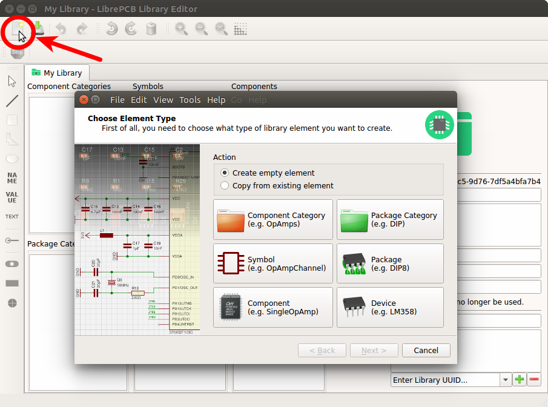

:example_part_name: LMV321LILT
===== Example: {example_part_name}

Let's say you want to create the part {example_part_name} from A to Z. We will
create now all the necessary library elements for the {example_part_name},
though in practice you only need to create the elements which do not already
exist. You can even use elements from other libraries, for example the Symbol
from library _A_, the Component from library _B_ and the Package from library _C_.

====== Component Category

First you should create a Component Category for the {example_part_name} (if it
doesn't already exists). Choose a suitable (generic!) name and select a parent
category. You may first need to create the required parent categories.

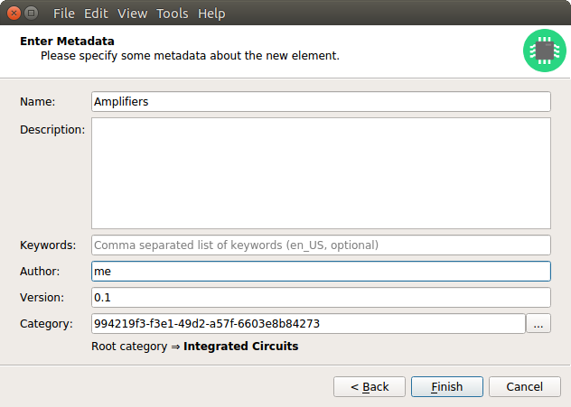

After clicking on _Finish_, your first Component Category is ready to be used :)

===== Symbol

Now we need to create a Symbol for the OpAmp. So this time you click on the
_Symbol_ button in the _New Library Element_ wizard. Then fill in some metadata
and click on _Finish_. Now you can place the required pins (choose reasonable
names!) and draw the outline. The result could look like this:

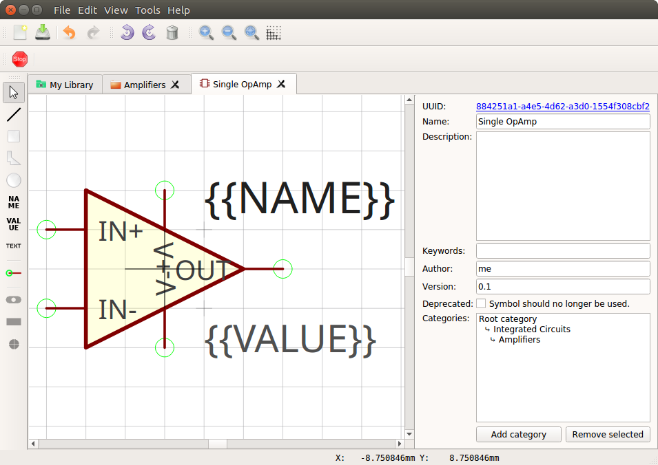

_Yeah, the overlapping texts look ugly, but let's ignore that for the moment ;)_

===== Component

The next element you need to create is the Component for a single OpAmp. Because
it is still very generic (beside the {example_part_name} there are many other
OpAmps with exactly the same functionality), so you should enter a generic name
like _Single OpAmp_. In addition, it's really important to choose a Category for
the new Component, otherwise it's hard to find it in the library when you want
to add it to a schematic.

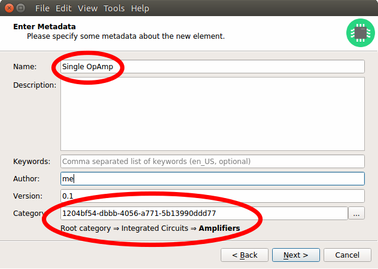

Then you're asked to specify some properties of the Component:

* *Schematic-Only*: This should be checked if the Component must not appear on
  a board, but only in the schematics. This is typically used for schematic
  frames (yes, they are also Components).
* *Prefix*: When adding the Component to a schematic, its name (designator) is
  automatically set to this value, followed by an incrementing number. So if
  you choose the prefix _R_, components added to a schematic will have the names
  _R1_, _R2_, _R3_ and so on. The prefix should be very short and uppercase.
* *Default Value*: In addition to the name, Components also have a value assigned
  to it, which is typically also displayed in the schematic. For example a
  capacitor has its capacitance (e.g. _100nF_) set in its value. When adding a
  Component to a schematic, its value is initially set to the value specified here.
  The value can also be a placeholder, for example `#PARTNUMBER`, `#RESISTANCE`
  or `#CAPACITANCE`. If you are unsure, just leave it empty, you can still change
  it later.

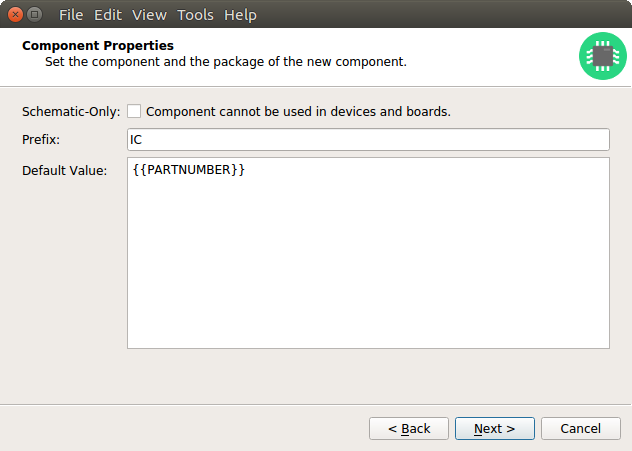

Now you need to choose the Symbols which represent the Component in schematics.
Most Components have only one Symbol, but you can also add more than one, for
example an OpAmp can have separate Symbols for power and amplifier.

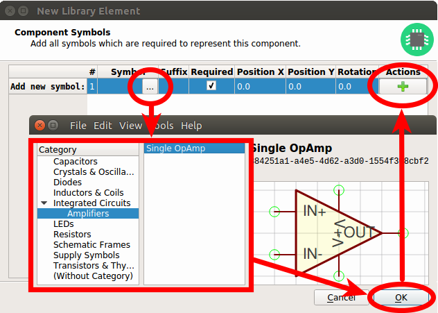

After adding the OpAmp Symbol, it should look like this:

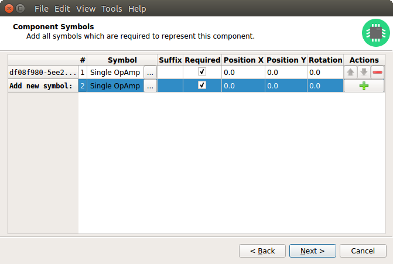

The next step is to define all so-called Signals of a Component. Signals represent
the "electrical interface" of a Component. For example a transistor consists of
the Signals _base_, _collector_ and _emitter_. For a Component it's irrelevant
whether the "real" transistor has multiple emitter pads, or an additional
thermal pad and so on, the Component only specifies the three Signals.

LibrePCB automatically extracts the Signals from the Pins of the specified Symbols,
so often we don't have to do this by hand. But sometimes you still should adjust
the names or properties of these Signals. For the OpAmp, we check _Required_ for
all Signals, so the ERC will show a warning if these Signals are not connected to
a net when the Component was added to a schematic:

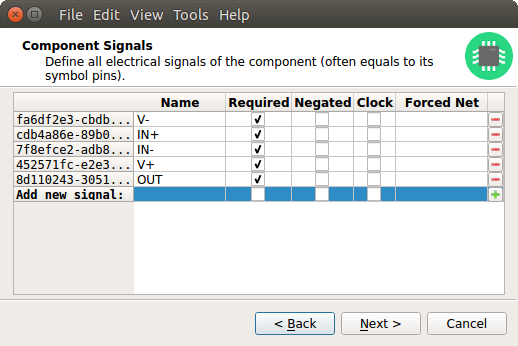

These Signals now need to be assigned to the corresponding Symbol Pins, but as
they were automatically generated from the Pins, you can just click on the button
below to automatically assign all Pins to their Signals:

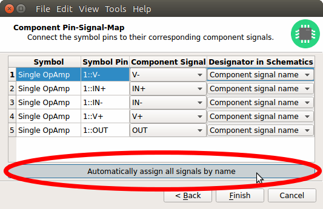

That's it, the Component is now ready to be used:

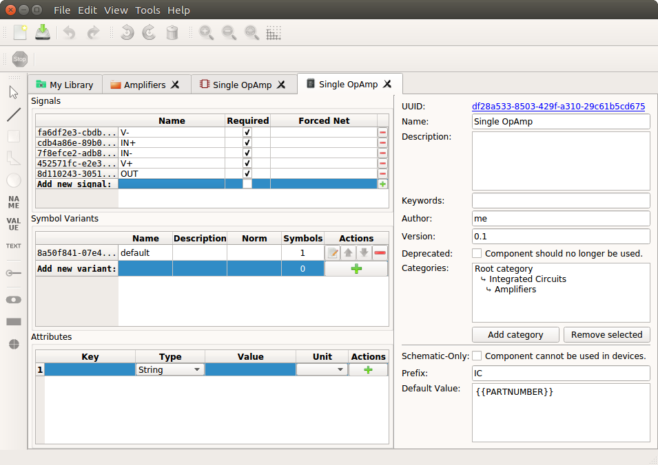

[NOTE]
====
For this simple example, this procedure may feel a little bit complicated. This
is basically caused by the high flexibility of the library concept. The Component
which we created now actually uses only the very basic library features, but
as soon as you understand the whole library concept, you will be able to easily
create much more powerful library elements. We're sure you will love the
flexibility of the library concept ;)
====

===== Package Category

Before creating a Package for the {example_part_name}, you should (optionally)
create a category for it. This is basically done exactly the same way as you
already created the Component Category, so we won't explain it again. It could
look like this:

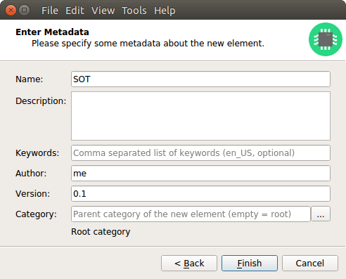

===== Package

Then you need to create the Package for the {example_part_name}, which is called
_SOT23-5_. After specifying some metadata (like you already done for other library
elements), you are asked to specify all pads of the Package. The _SOT23-5_ has 5
pads which we just name from _1_ to _5_:

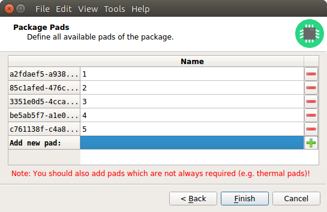

[TIP]
====
Packages should be designed as generic as possible to make them usable also for
other Devices. So it's very important to name their pads according to the
specifications of the Package (e.g. as defined in IPC-7351), not according to
their functionality for your specific Device.

Typical pad names are: _1_, _2_, _3_, _THERMAL_, ... +
Bad pad names are: _BASE_, _EMITTER_, _COLLECTOR_, _SDA_, _SCL_, ...
====

After that, you can start drawing the footprint of the Package. It's recommended
to start with the pads:

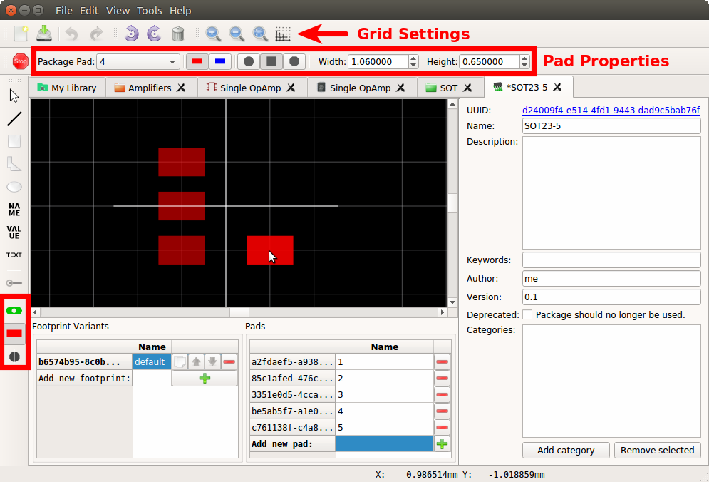

And then add other graphical items like the outline, name and value:

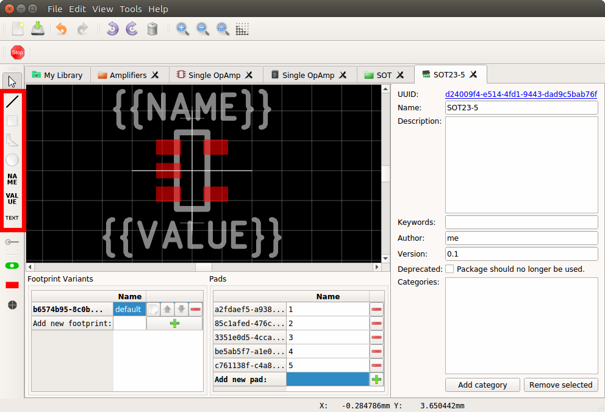

That is already enough for a simple footprint.

===== Device

The last library element you need to create is the Device which combines the
Component _Single OpAmp_ with the Package _SOT23-5_. Again, specify some metadata
about the Device first. Then you need to choose the Component and Package you
want to assign:

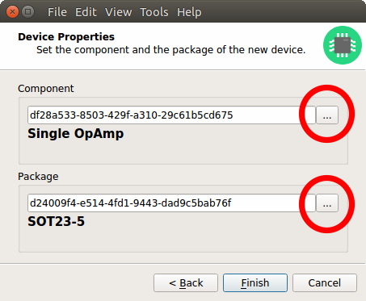

Then you have to assign the Package pads to Component signals according to
the datasheet of the {example_part_name}:

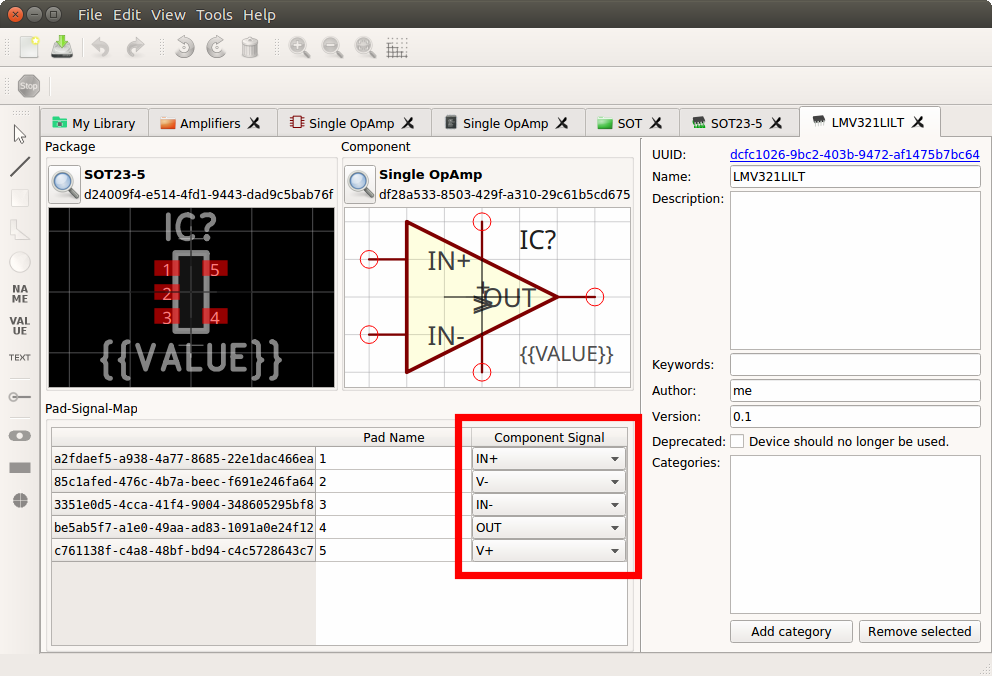

And that's it! In the library overview (the first tab in the Library Editor)
you can see all the elements you have created:

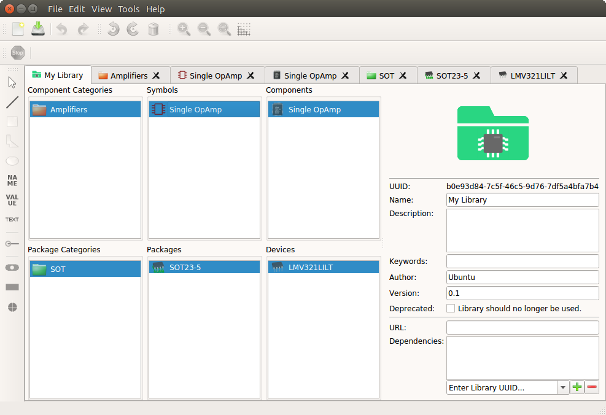

The {example_part_name} is now ready to be added to schematics and boards.
And because the Categories, Symbol, Component and Package are quite generic,
they can also be used for many other library elements :)
