[#gettingstarted-libraries-local]
= Create Local Libraries

Of course you can also create your own libraries. To do so, enter some metadata
in the tab _Create local library_ and click on _Create Library_:

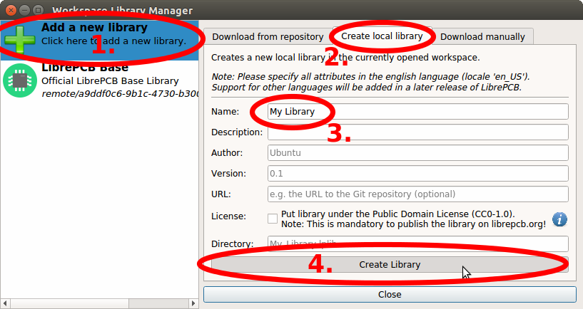

Now you can open the library editor to create some symbols and footprints in
your new library. Select your library on the left and then click on the
_Open Library Editor_ button:

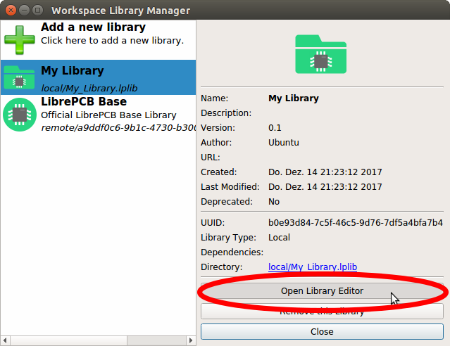

Now we need a crash course to understand the basics of LibrePCB's library
concept ;) A library consists of several different elements:

* *Component Category*:
  These are basically "metadata-only" elements used to categorize the "real"
  library elements in a category tree. Every Symbol, Component and Device can be
  assigned to one or more categories so they will appear in the category tree.
  Examples: _Resistors_. _LEDs_, _Microcontrollers_
* *Symbol*:
  A symbol is the graphical representation of a Component (or parts of it) in a
  schematic. It consists of electrical pins and graphical objects like lines.
  Examples: _European Resistor_, _LED_, _1x10 Connector_
* *Component*:
  A Component basically represents a "generic" kind of electrical part. It's
  *not* a real part which you can buy, it's just theoretical. The Component
  defines the electrical interface of a part and how it is represented in the
  schematic (by referencing one ore more Symbols). But it does not define how
  the part looks like in a board.
  Examples: _Resistor_, _Bipolar Capacitor_, _4-channel OpAmp_
* *Package Category*:
  Exactly the same as Component Categories, but for Packages instead of
  Components.
  Examples: _Chip Resistors_, _Axial Capacitors_, _DIP_
* *Package*:
  As the name suggests, packages represent the mechanical part of a "real"
  electronic part. It contains the footprint with their electrical pads and
  graphical objects which is then added to boards. Later a package may also
  contain a 3D model for the 3D board viewer.
  Examples: _TO220_, _DIP20_, _LQFP32_
* *Device*:
  The Device now represents a real electronic part which you can buy. It
  basically combines a Component with a Package to specify how a Component
  looks like on the board.
  Examples: _0805 Resistor_, _LM358D_, _STM32F103C_

[NOTE]
====
The order of this list is actually also the order to follow when creating new
library elements. For example a Device always needs to be created *after* the
corresponding Component. The other direction is not possible because of the
dependencies.
====

Ready to create your first library elements? At the top left of the library
editor there is the entry point for every new library element. There you can
choose which of the six library element type you want to create:

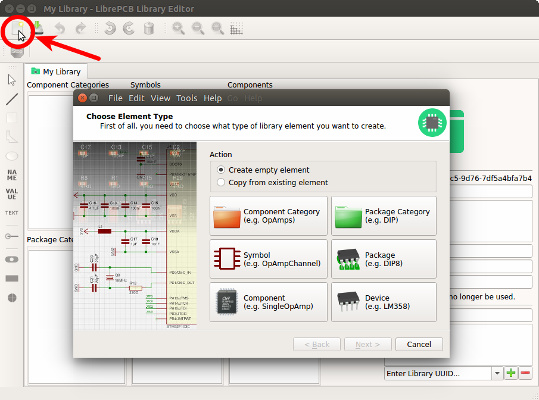

:example_part_name: LMV321LILT
*Example: {example_part_name}*

Let's say you want to create the part {example_part_name} from A to Z. We will
create now all the necessary library elements for the {example_part_name},
though in practice you only need to create the elements which do not already
exist. You can even use elements from other libraries, for example the Symbol
from library _A_, the Component from library _B_ and the Package from library
_C_.

[#gettingstarted-libraries-cmpcat]
== Component Category

First you should create a Component Category for the {example_part_name} (if it
doesn't already exists). Choose a suitable (generic!) name and select a parent
category. You may first need to create the required parent categories.

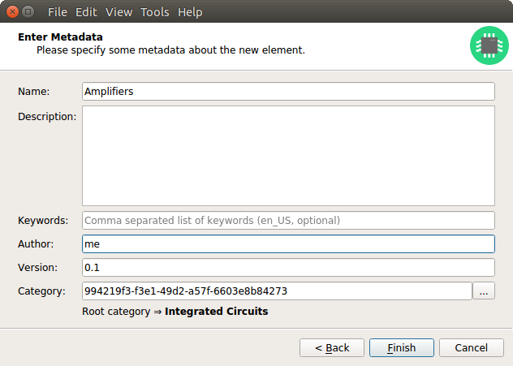

After clicking on _Finish_, your first Component Category is ready to be used :)

[#gettingstarted-libraries-sym]
== Symbol

Now we need to create a Symbol for the OpAmp. Click on the
_Symbol_ button in the _New Library Element_ wizard, fill in some metadata
and click on _Finish_. Now you can place the required pins (choose reasonable
and unique names!), add the `{{NAME}}` and `{{VALUE}}` text elements and draw
the outline. The result should look like this:

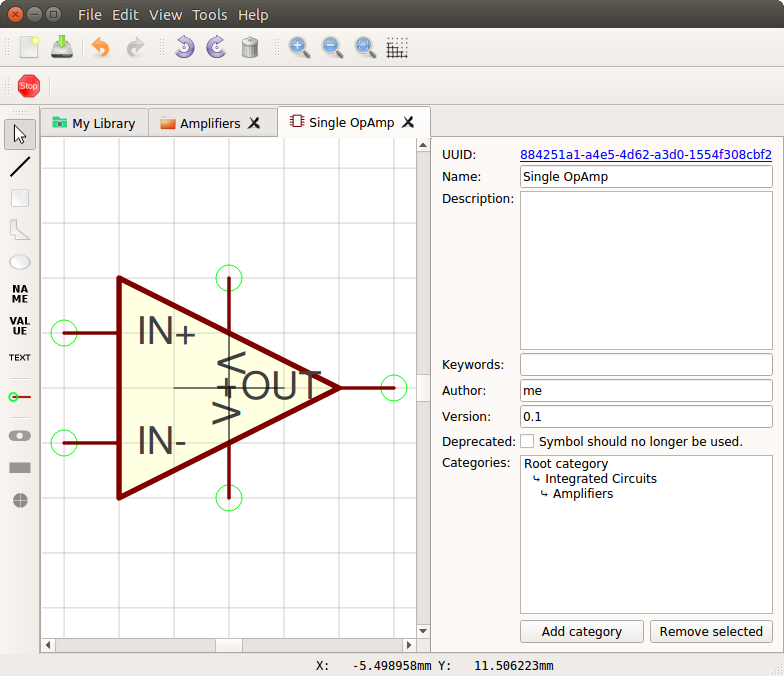

_Yes, the overlapping pin texts look ugly, but let's ignore that for the
moment ;)_

.Symbol Conventions
[NOTE]
====
For details about how symbols should be designed, please take a look at our
<<libraryconventions-symbols,Symbol Conventions>>. The most important rules are:

- For generic components, create generic symbols (e.g. _Diode_ instead of
  _1N4007_).
- The origin (coordinate _0,0_) should be in (or close to) the center of the
  symbol.
- Pins must represent the _electrical_ interface of a part, not the
  _mechanical_. So don't add multiple pins with the same function (e.g. _GND_)
  and don't name pins according their location in the package. Name them
  according their electrical purpose (e.g. _IN+_, _IN-_, _OUT_) instead, or
  just use incrementing numbers (i.e. _1_, _2_, _3_, ...).
- Pins should be grouped by functionality and must be placed on the 2.54mm
  grid.
- There should be text elements for `{{NAME}}` and `{{VALUE}}`.
====

[#gettingstarted-libraries-cmp]
== Component

The next element you need to create is the Component for a single OpAmp. Because
it is still very generic (beside the {example_part_name} there are many other
OpAmps with exactly the same functionality), so you should enter a generic name
like _Single OpAmp_. In addition, it's really important to choose a Category for
the new Component, otherwise it's hard to find it in the library when you want
to add it to a schematic.

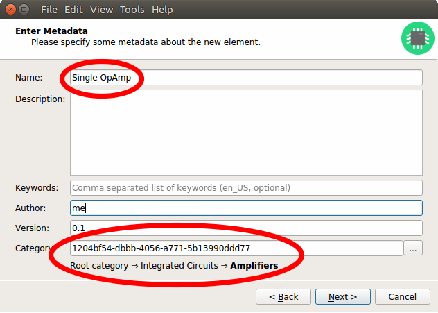

Then you're asked to specify some properties of the Component:

* *Schematic-Only*: This should be checked if the Component must not appear on
  a board, but only in the schematics. This is typically used for schematic
  frames (yes, they are also Components).
* *Prefix*: When adding the Component to a schematic, its name (designator) is
  automatically set to this value, followed by an incrementing number. So if
  you choose the prefix _R_, components added to a schematic will have the names
  _R1_, _R2_, _R3_ and so on. The prefix should be very short and uppercase.
* *Default Value*: In addition to the name, Components also have a value
  assigned to it, which is typically also displayed in the schematic. For
  example a capacitor has its capacitance (e.g. _100nF_) set in its value.
  When adding a Component to a schematic, its value is initially set to the
  value specified here. The value can also be a placeholder, for example
  `{{PARTNUMBER}}`, `{{RESISTANCE}}` or `{{CAPACITANCE}}`. If you are unsure,
  just leave it empty, you can still change it later.

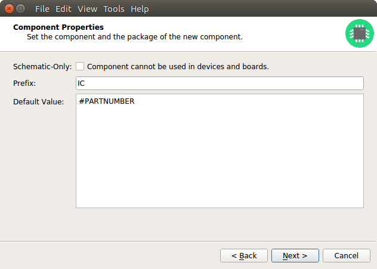

Now you need to choose the Symbols which represent the Component in schematics.
Most Components have only one Symbol, but you can also add more than one, for
example an OpAmp can have separate Symbols for power and amplifier.

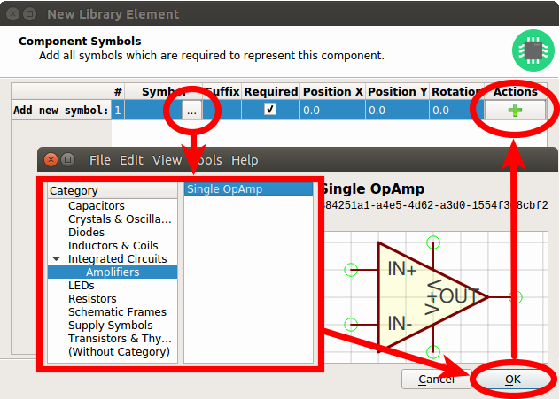

After adding the OpAmp Symbol, it should look like this:

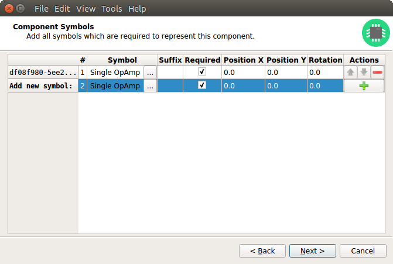

The next step is to define all so-called Signals of a Component. Signals
represent the "electrical interface" of a Component. For example a transistor
consists of the Signals _base_, _collector_ and _emitter_. For a Component
it's irrelevant whether the "real" transistor has multiple emitter pads, or
an additional thermal pad and so on, the Component only specifies the three
Signals.

LibrePCB automatically extracts the Signals from the Pins of the specified
Symbols, so often we don't have to do this by hand. But sometimes you still
should adjust the names or properties of these Signals. For the OpAmp, we
check _Required_ for all Signals, so the ERC will show a warning if these
Signals are not connected to a net when the Component was added to a schematic:

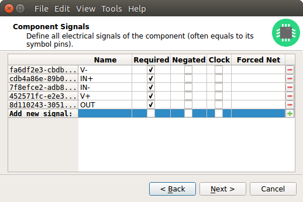

These Signals now need to be assigned to the corresponding Symbol Pins, but as
they were automatically generated from the Pins, you can just click on the
button below to automatically assign all Pins to their Signals:

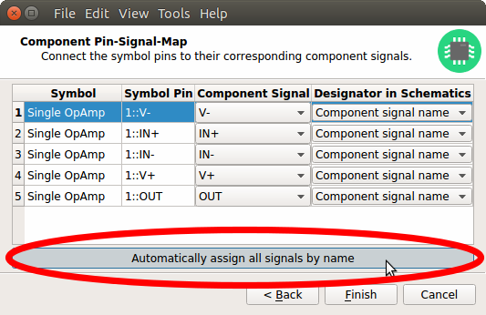

That's it, the Component is now ready to be used:

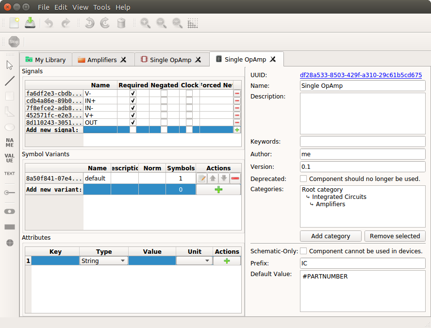

[NOTE]
====
For this simple example, this procedure may feel complicated. This
is due to the broad flexibility of the librepcb library approach. The Component
which we created actually only uses basic library features, but
as soon as you understand the our library concepts, you will be able to easily
create much more powerful library elements. We're sure you will love the
flexibility of the library concept ;)
====

.Following are the most important rules to create reusable Components:
[TIP]
====
- Create generic components whenever possible. Only create specific components
  for manufacturer-specific parts (like microcontrollers).
- Name signals according their electrical purpose (e.g. _Source_, _Drain_,
  _Gate_).
- Don't add multiple signals with the same name. Even for a microcontroller
  which has multiple GND pins, the component should have only one GND signal.
  A component represents the _electrical_ interface of a part, not the
  _mechanical_!
====

[#gettingstarted-libraries-pkgcat]
== Package Category

Before creating a Package for the {example_part_name}, you should (optionally)
create a category for it. This is basically done exactly the same way as you
already created the Component Category, so we won't explain it again. It could
look like this:

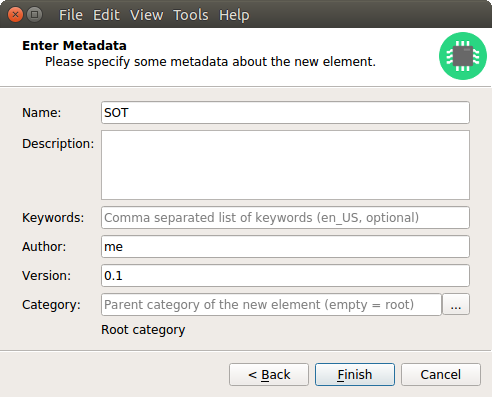

[#gettingstarted-libraries-pkg]
== Package

Then you need to create the Package for the {example_part_name}, which is called
_SOT23-5_. After specifying some metadata (like you already did for other
library elements), you are asked to specify all pads of the Package. The
_SOT23-5_ has 5 pads which we just name from _1_ to _5_:

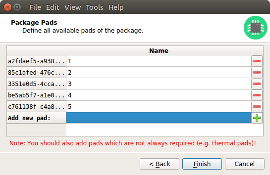

After that, you can start drawing the footprint of the Package. It's recommended
to start with the pads:

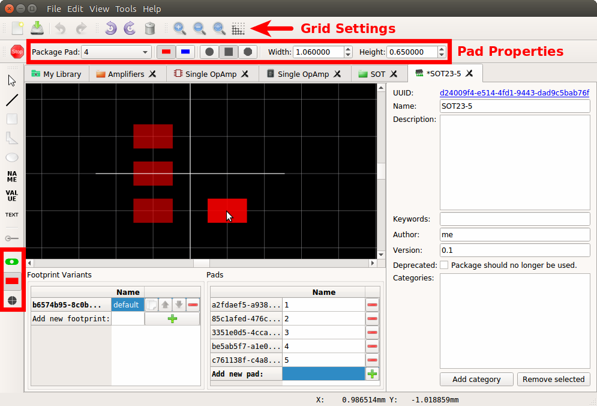

And then add other graphical items like the outline, name and value:

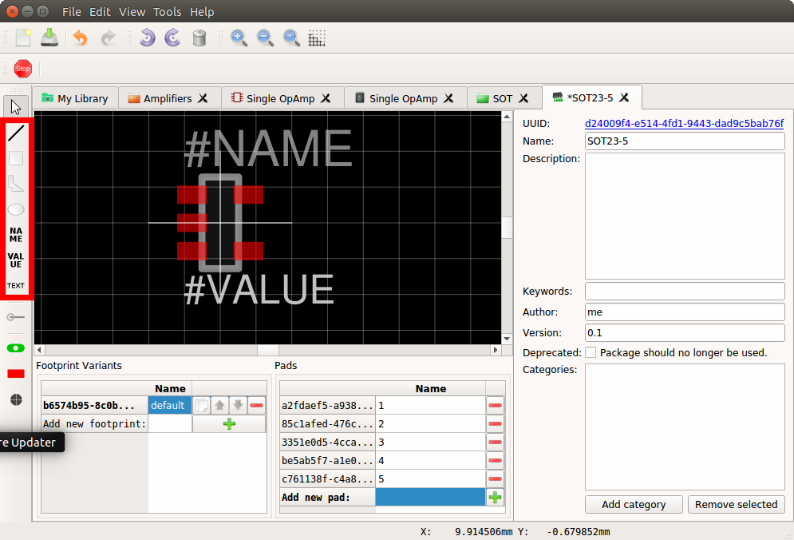

That is already enough for a simple footprint.

.Package Conventions
[NOTE]
====
For details about how Packages should be designed, please take a look at our
<<libraryconventions-packages,Package Conventions>>. The most important rules
are:

- Create generic packages, not specific ones. For example _DIP08_ is _DIP08_ --
  no matter whether it's an OpAmp, an EEPROM or a microcontroller.
- The origin (coordinate _0,0_) should be in the center of the Package body.
- Footprints must be drawn from the top-view. When a footprint needs to appear
  on the bottom of a board, this can be done in the board by mirroring it.
- Add *all* pads of a package, not only the one you currently need. For example
  if the package has a thermal pad, you should add it, even if you currently
  don't need it.
- Name pads according IPC-7351 (if applicable), typically just _1_, _2_, _3_
  etc. Only name pads according their electrical purpose (e.g. _Gate_) if the
  Package is very specific for a particular purpose.
- Pin 1 should always be at the top left.
- There should be text elements for `{{NAME}}` and `{{VALUE}}`.
====

[#gettingstarted-libraries-dev]
== Device

The last library element you need to create is the Device which combines the
Component _Single OpAmp_ with the Package _SOT23-5_. This is actually the only
library element which is specifically for {example_part_name} -- all previously
created elements are generic!

Again, specify some metadata about the Device first. Then you need to choose
the Component and Package you want to assign:

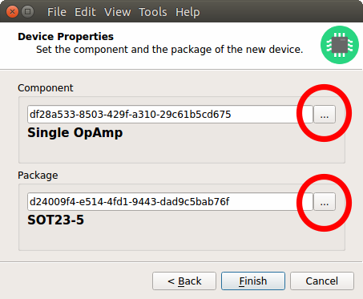

Then you have to assign the Package pads to Component signals according to
the datasheet of the {example_part_name}:

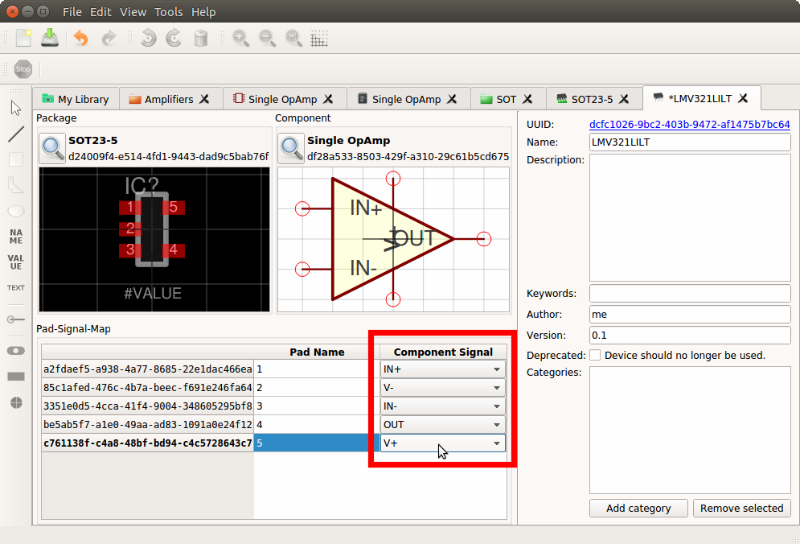

And that's it! In the library overview (the first tab in the Library Editor)
you can see all the elements you have created:

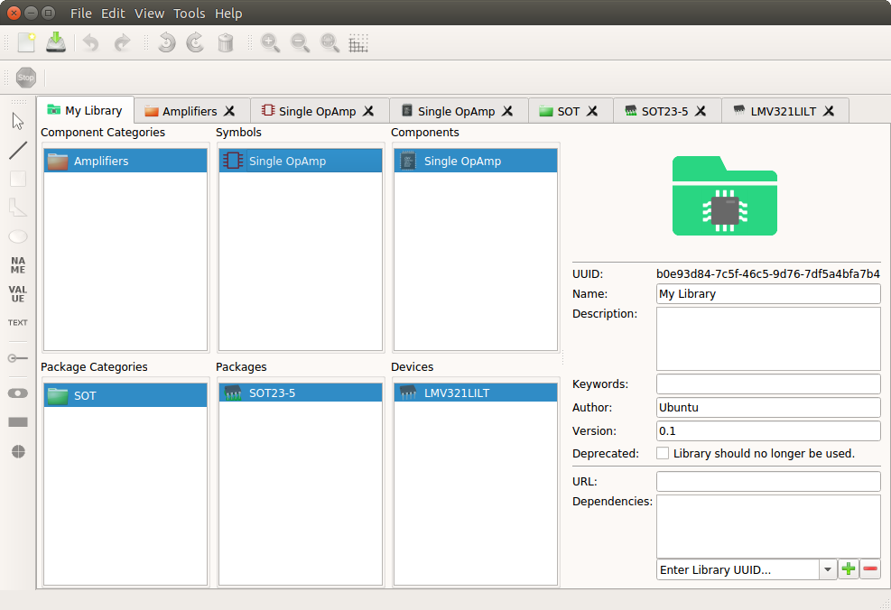

The {example_part_name} is now ready to be added to schematics and boards.
And because the Categories, Symbol, Component and Package are quite generic,
they can also be used for many other library elements :)
