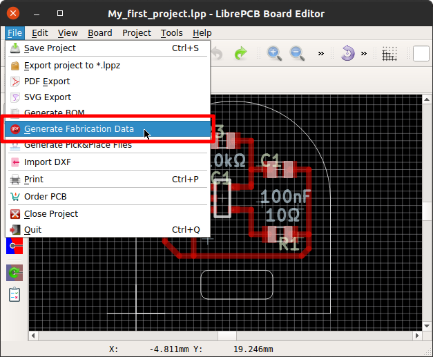

[#gettingstarted-order]
= Order PCB

Once the board is finished, the easiest and fastest way to order the PCB is
<<gettingstarted-order-fab>>. It automatically exports and uploads all
the necessary production data files without annoying you with the whole
traditional production data workflow.

[TIP]
====
You prefer to manually generate the production data files? Or you want to use
a PCB manufacturer not available at <<gettingstarted-order-fab>>? No problem!
Just skip this section and go to <<gettingstarted-production-data>>.
====

[#gettingstarted-order-fab]
== LibrePCB Fab

To start the order process, open the corresponding dialog from either the
schematic- or board editor:

Then just click on the button to upload the project to our fabrication
service https://fab.librepcb.org[fab.librepcb.org]:

After the upload, the web browser is automatically opened where you can review
and continue the order. More information about this service is available
https://fab.librepcb.org/about[here].

[TIP]
====
Alternatively you could also export your LibrePCB project as a *.lppz archive
(under the _File_ menu item) and then upload this file with the web browser on
https://fab.librepcb.org[fab.librepcb.org]. This procedure might be useful if
for some reason the direct upload is not desired or doesn't work (e.g. due to
a corporate firewall).
====

[#gettingstarted-production-data]
== Generate Production Data

Instead of using <<gettingstarted-order-fab>>, of course you can also generate
the production data manually and forward these files to any PCB manufacturer
you like:

Here you can adjust some settings of the Gerber export. Generally you should
determine what format your PCB manufacturer accepts. Many manufacturers accept
Protel-style Gerber files, so if you're unsure, click on the _Protel naming_
button:

image:img/create_board_production_data_generator.png[alt="Production Data Generator"]

Then just click on the _Generate Gerber & Excellon Files_ button and LibrePCB
places the generated files in your project's _output_ subdirectory. These
files can then be sent to your PCB manufacturer for production.

[WARNING]
====
It's highly recommended to cross-check the generated files with 3rd-party tools
like http://gerbv.geda-project.org[gerbv] or
https://gerber.ucamco.com/[the reference gerber viewer]. LibrePCB is not
responsible for any implications caused by wrong production data.
====
