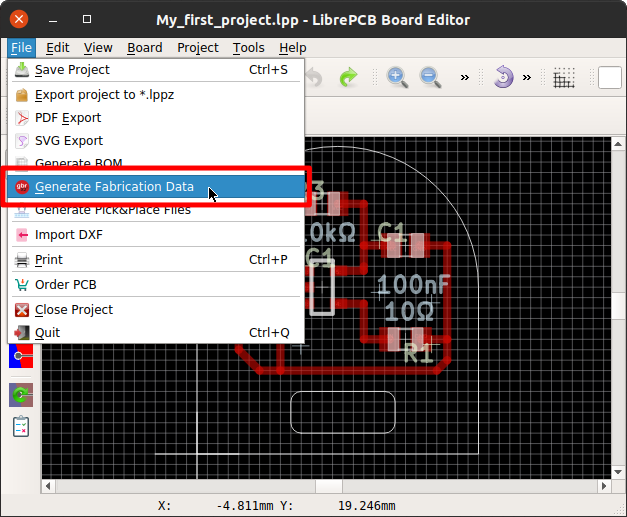
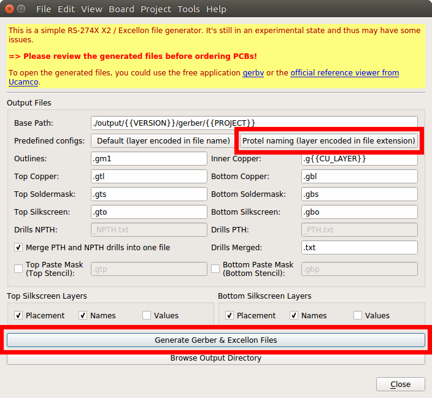

[#gettingstarted-production-data]
=== Generate Production Data

Once the board is finished, you can generate the production data for the PCB
manufacturer:

With a simple button click the Gerber and Excellon files are created inside the
project's _output_ subdirectory:

[WARNING]
====
The production data generator is currently very limited in functionality, and also
not very mature. It's highly recommended to cross-check the generated files with
3rd-party tools like link:http://gerbv.geda-project.org[gerbv].

LibrePCB is not responsible for any implications caused by wrong production data.
====
