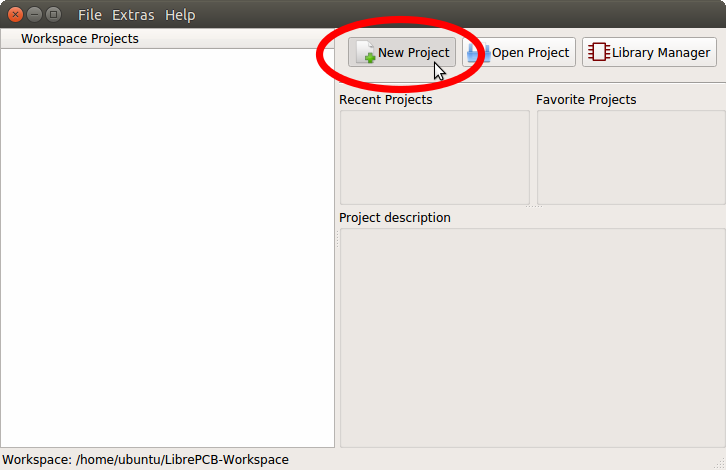
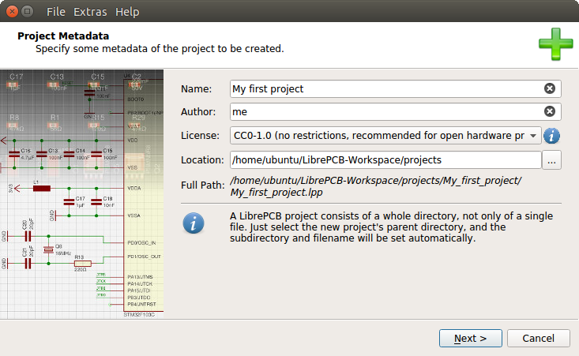
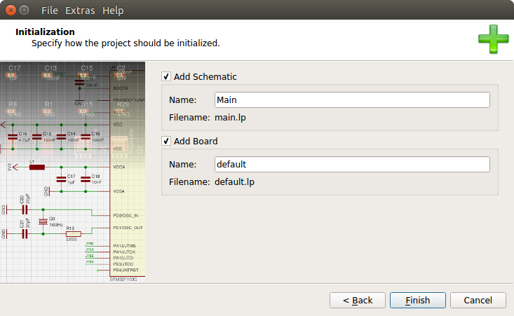
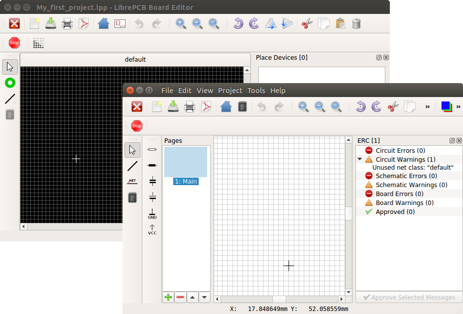

[#gettingstarted-project]
=== Create a New Project

In LibrePCB, schematics and boards are always part of a Project, so before creating
schematics and boards you first need to create a Project for every PCB. This is really easy,
just follow the _New Project_ wizard:

Fill in some Project metadata:

[TIP]
====
For Open-Hardware projects it's highly recommended to select the license
_CC0-1.0_ as this allows everyone to use your project without restrictions.
====

[TIP]
====
While it is possible to create the Project outside the Workspace directory,
it's recommended to store all Projects within the Workspace because these
are then included in the Control Panel by default making them easy to
locate and use. Projects outside the Workspace need to be opened by
specifying their location in an open dialog.
====

Now you can choose whether the Project should be initialized with a first
schematic page and board, and how they are named. If you are unsure, just
accept the default values:

After clicking on _Finish_, the schematic and board editors show up and you're
ready to draw the schematics:

include::schematics.adoc[]

include::boards.adoc[]

include::production_data.adoc[]