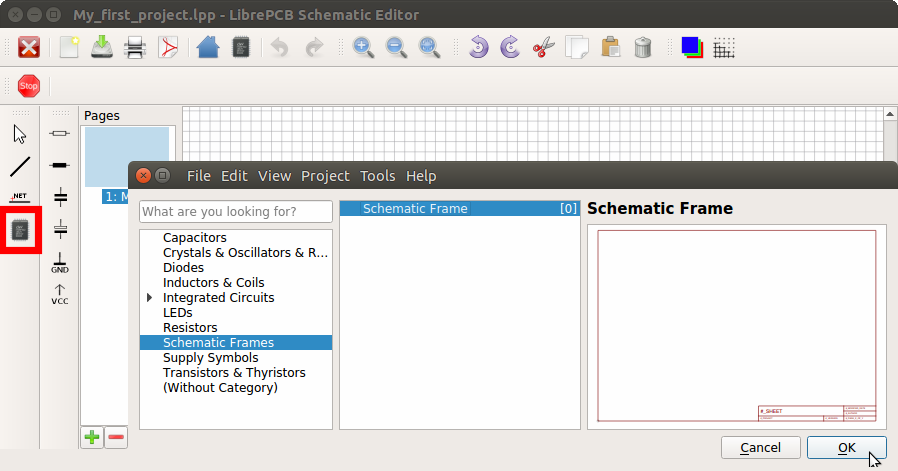
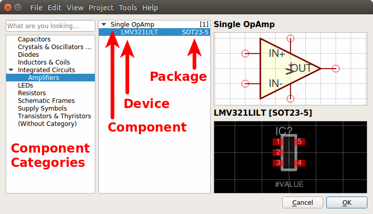
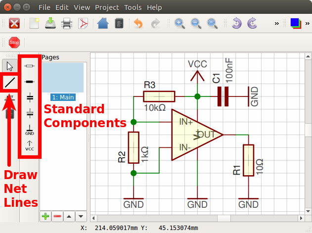

[#gettingstarted-schematics]
=== Create Schematics

First, you may want to add a frame to the schematic. This is done by choosing a
schematic frame in the Component Chooser:

Then let's add the OpAmp we have created in our own library, again with the
Component Chooser:

Here you can choose whether you want to add the Component _Single OpAmp_ or
the Device _LMV321LILT_. Yes, you can add either a Component or a Device to
a schematic ;) Actually the schematic always contains Components (not Devices),
but you can still (optionally) choose the Device which will be used later when
adding the Component to the board (boards always contain Devices).

The most commonly used Components are also available in the toolbar on the
left side:

Just place some Components and draw the net lines with the corresponding tool
in the toolbar at the left side.