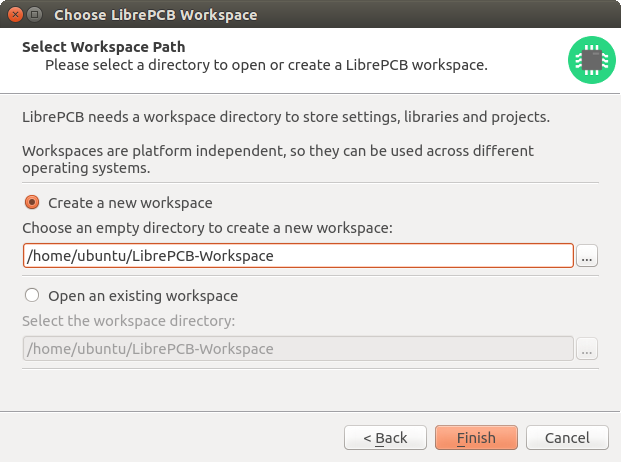

[#gettingstarted-workspace]
=== Create a Workspace

When starting LibrePCB the first time, a wizard asks you to open or create a
Workspace. The Workspace is just a directory where settings, libraries and
(optionally) projects will be stored. Once created, it can be used from all
supported operating systems (i.e. it is platform independent) and in future
it will also be usable with different LibrePCB versions.

You can just accept the default Workspace location (you could still move it
to another location afterwards, if desired):

After clicking _Finish_, the Control Panel shows up and you're ready to start
using LibrePCB!
