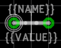

[#libraryconventions-packages]
=== Package Conventions
:ipc7351-pdf: http://pcbget.ru/Files/Standarts/IPC_7351.pdf
:ipc7351-naming-pdf: http://ohm.bu.edu/~pbohn/__Engineering_Reference/pcb_layout/pcbmatrix/IPC-7x51%20&%20PCBM%20Land%20Pattern%20Naming%20Convention.pdf
:ipc7351c-slides: https://ocipcdc.org/archive/What_is_New_in_IPC-7351C_03_11_2015.pdf

[NOTE]
====
These guidelines are not yet complete. Help us create sensible conventions
https://github.com/LibrePCB/librepcb-doc/issues?q=is%3Aissue+label%3A%22Conventions%3A+Packages%22[on GitHub]!
====

[#libraryconventions-packages-scope]
==== Scope

The most important thing to consider when creating a Package is the scope
of it. Since LibrePCB handles footprints differently than other EDA tools,
special attention is required here.

Think about the appearance of the part (the
mechanical shape, dimension and color). If two parts look exactly (or _almost_)
equal, they can use the same Package. If they look different, two separate
Packages must be created.

[TIP]
====
*Don't think about the land pattern (i.e. footprint) of the part* -- it's not
relevant for this decision. Even if a package can be mounted differently on
a PCB (e.g. a THT resistor can be mount horizontally or vertically) and thus
require different footprints, only one Package is needed. Similarly, two different-looking parts that have the same land pattern (e.g. a SMD resistor and a SMD LED) should still be two separate Packages.
====

.Color (e.g. 0805 LED)
====
Even if a 0805 LED with a transparent lens has exactly the same footprint as a 
0805 LED with a red lens, they should have *separate Packages because of the
different color*. This way a Device can link to the Package with the proper
color, and thus it will appear with the proper color in the 3D PCB preview
(once LibrePCB supports 3D models).
====

.Height (e.g. SO-8)
====
Some packages are available in different heights. For instance, SO-8 is available with
heights of 1.2mm and 1.4mm. *As the 3D models would be different, separate
Packages are needed*.

_Note: To avoid creating too many Packages, a small tolerance is allowed. So for
a device with a height of 1.3mm you might want to use the Package with a height of 1.4mm._
====

.Mounting variants (e.g. TO220)
====
Many packages can be mounted either vertically or horizontally, for example the
TO220. If mounted horizontally, there might be a hole in the PCB to screw the
metal tab down to the PCB, or you may want to solder the tab to the PCB without
a hole in it. For all these cases *only one Package is needed* -- the different
mounting variants should be handled by different footprint variants inside the Package.
====

[#libraryconventions-packages-naming]
==== Naming

The following conventions apply to Package names:

* *Language must be American English* (en_US), if applicable (many Packages
  have language-neutral names anyway).
* *If {ipc7351-naming-pdf}[IPC-7351] specifies a name for a given package, use
  that name* (e.g. "SOT95P280X145-5" instead of "SOT23-5"). Alternative names
  (like "SOT23-5") should be added to the comma-separated keywords list and maybe to the description.
* *Size information must use metric units*, not imperial units. For
  packages which are well known by their size in imperial units (e.g. "0805" which is
  "2012" in metric), it's recommended to write the well known name in
  parentheses. For example, a chip resistor could be named "RESC2012X70 (0805)".
* For packages which are available with different pin counts, *append the pin
  count with a hyphen as separator and omit leading zeros* (e.g. "DIP-8" instead
  of "DIP08").
* For manufacturer-specific packages, start with the manufacturers name
  (e.g. "Molex 53261-06"). _Note: Libraries do not act as namespaces for Package
  names, so you should start the Package name with the manufacturers name even
  if the Package is located in a manufacturer-specific library._

[#libraryconventions-packages-pads]
==== Pads

* *Always add all pads of Packages*, even those which are not always connected.
For example, the package "TO220" has a metal tab, so you should
  define it as a pad, no matter if it's often not connected (and even not
  connectable when mounted vertically).
* *Use pad names according {ipc7351-pdf}[IPC-7351]* (if applicable). For
  Packages which are not covered by IPC-7351:
** If the function of a pad is absolutely clear, choose its abbreviated
   functionality as name (e.g. "A" for anode and "C" for cathode).
** Otherwise just use numbers starting with "1" at top left and increment
   them counterclockwise.

[#libraryconventions-packages-footprints]
==== Footprint Variants

Within a Package there can be multiple footprint variants. They are intended
to support the following use-cases:

* *Mounting variants*: For example, a THT resistor can be mounted either
  vertically or horizontally with various pad distances. Every common mounting
  variant should be available as footprint variants.
* *Soldering techniques*: Many packages can be soldered either by reflow-,
  wave- or hand-soldering, which usually require different land patterns. For
  every suitable soldering technique there should be a corresponding footprint
  variant.
* *Density levels*: {ipc7351-pdf}[IPC-7351] specifies three different density
  levels for footprints:
+
--
* Density Level A: Maximum (Most) Land Protrusion
* Density Level B: Median (Nominal) Land Protrusion
* Density Level C: Minimum (Least) Land Protrusion
--
If applicable, these three density levels should also be added as footprint
variants.

.Combinations
[NOTE]
====
As a given Package might support multiple of the use-cases above, all suitable
combinations of them should be added. For example a Package which should have
all three density levels as defined in IPC-7351 and can be mounted either
vertically or horizontally would need six footprint variants to support all
possible use-cases.
====

.Set default footprint
[IMPORTANT]
====
*The first footprint is always the default footprint*, so you should move
the most reasonable footprint to the top of the footprint list! The default
footprint should fulfill these rules:

* Designed according density level A (if applicable)
* Suitable for reflow soldering (if applicable)
* Most natural mounting variant (e.g. horizontal for THT resistors, or
  vertical for Transistor Outline packages)
====

.THT resistor 0207 footprint variants
====

====

[#libraryconventions-packages-origin]
==== Origin

*The origin _(0, 0)_ should be exactly at the center of the package body*. It
is used by pick and place machines.

Some packages (especially those with non-symmetrical body) have the origin
explicitly specified in the datasheet. In that case, use the origin from
the datasheet.

[#libraryconventions-packages-orientation]
==== Orientation

*Footprints must be drawn from the top-view*. When a footprint needs to appear
on the bottom of a board, this can be done in the board editor by mirroring it.

*Pin 1 should always be at the top left*, as defined in
{ipc7351c-slides}[IPC-7351C "Level A"] (slide 22).

.Footprint orientation examples
====

====

[#libraryconventions-packages-textelements]
==== Text Elements

Typical footprints should have exactly two text elements: `{{NAME}}` and
`{{VALUE}}`.

The name should normally be placed at top of the package body, slightly above
the outline and aligned at bottom center. The value should be placed at the
bottom center, slightly below the package body and aligned at the top center.

*Always make sure that the text elements do not overlap with pads or with the
placement layer*. Otherwise the text might be unreadable on silkscreen. In
addition, text elements should usually be placed outside the Package body to
still see them on silkscreen of an assembled PCB.

Keep in mind that the bottom-aligned anchor is placed on the text baseline. This means that some letters like "g" or "y" might extend slightly below the anchor.

// Image floats at the right of the table
.Typical footprint name properties

.Typical text element properties
[cols="s,e,e",options="header,autowidth"]
|===
| Property          | Name text element     | Value text element
| Layer             | Top Names             | Top Values
| Text              | {{NAME}}              | {{VALUE}}
| Alignment         | Bottom Center         | Top Center
| Height            | 1.0mm (or larger)     | 1.0mm (or larger)
| Stroke Width      | 0.2mm (or thicker)    | 0.2mm (or thicker)
| Letter Spacing    | Auto                  | Auto
| Line Spacing      | Auto                  | Auto
| Mirror            | No                    | No
| Auto-Rotate       | Yes                   | Yes
|===

.Special cases
[NOTE]
====
These rules should be fine for many Packages, but probably not for all of
them. For special cases it's allowed to have slightly different properties
if they are more suitable.
====

.Footprint text element examples
====

====
